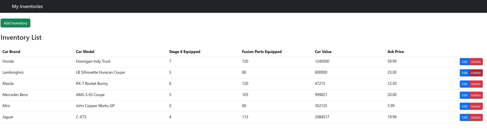

# web603-project

## Description
This application serves as an interactive marketplace for the popular mobile racing game CSR2. It offers a dual-function platform that enhances the gaming experience for its users. From a non-technical standpoint, the application is designed to cater to two main functionalities:


Online Store for Game Enhancements: Gamers can conveniently purchase various in-game assets like coin packages, items, and more, directly through the platform. It acts as a personalized storefront, providing a seamless shopping experience to boost their gameplay.

In-Game Car Trading Feature: Users are empowered to list their in-game vehicles for sale, determining prices based on the car's value within the CSR2 community. This creates an engaging space for players to trade and optimize their car collections.

## Walkthrough
This project involves a two-part build-out: server side and client side.

### Server Side
The server-side application, `node-mongo`, is an Express JS application designed to securely manage the inventory data, which is stored in MongoDB, offering CRUD operations through a RESTful API. 

#### Getting Started
For you to run the app properly on your machine, add a `.env` that configures the host to connect to your MongoDB instance. For example:

```
DATABASE=mongodb://${your-ip}:27017/trade-app
```

Connect to MongoDB and run Mongo Compass (for visualizing and managing data manually) by
```bash
$ mongod
```
and then provide `"mongodb://localhost:27017"` as the URI in Mongo Compass to connect to your default local MongoDB instance.

---

If you are running MongoDB on a Windows Subsystem for Linux (WSL), you would need to run
```bash
$ mongod --bind_ip 0.0.0.0
```
(a convenience solution that tells your local MongoDB instance to accept connections from all IP address, which is meant for the IP address of WSL)

Then grab the actual IP by
```bash
$ ip addr | grep eth0
```
This IP address will be used for `.env` and Mongo Compass
```
DATABASE=mongodb://${your-ip}:27017/trade-app
```
and here


---

With Mongo DB running at the background and `node-mongo/` being the currect directory, start the client-side app by
```bash
$ npm start
```

Keep them running.

### Client Side
The client-side application, `trade-app`, is the React app that leverages state management techniques to provide real-time interaction with the inventory data.

Users can add, update, and remove inventory items, with changes immediately reflected in the user interface.

#### Getting Started
The client-side application is created by running
```bash
$ npx create-react-app trade-app
```
and then installing all required dependencies, such as `react-router-dom`, `reactstrap`, and so on.

Note that the proxy has been added to `package.json`
```
    "proxy": "http://localhost:8080",
```
*The purpose of adding proxy config is to allow us to run both front-end React application and back-end API server during development without running into cross-origin resource sharing (CORS) issues. It's a common practice in many React development environment, especially those created with Create React App (CRA).*

Finally, in a new terminal, with `trade-app/` being the current directory, start the app by running
```bash
$ npm start
```

After the application is successfully compiled and opened in your default browser, you would be able to use the application from a user's perspective.

## Screenshots Part 1: Server-side App (port 8080)
### DB for Inventories


### DB for Users


### CRUD Endpoints (Tested by Postman)


## Screenshots Part 2: Client-side App (port 3000)
### Home

a
#### Item Modal


### Add Item to Cart


### Checkout


### Sign In


### User Home


### Manage Inventory


### Add Inventory


#### After Adding Inventory


### Edit Inventory


### Delete Inventory (After)

